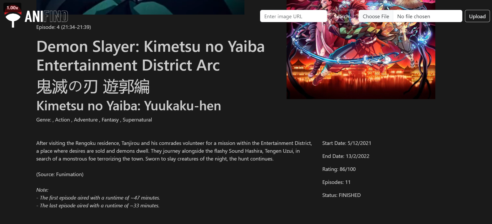
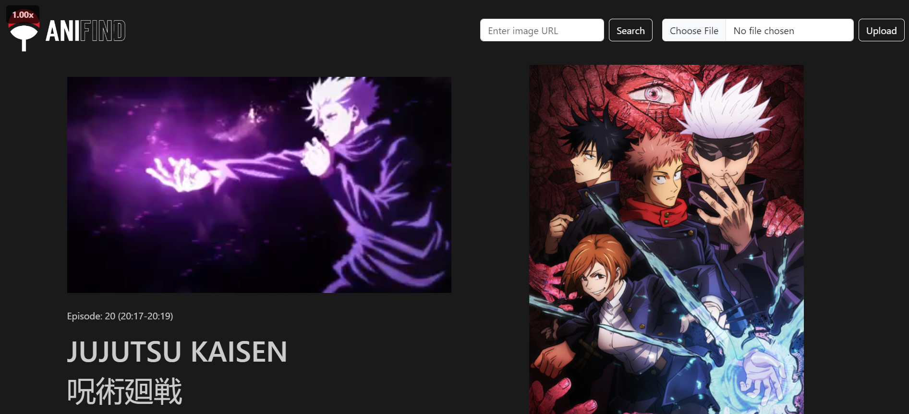

# AniFind


AniFind is an innovative web application that allows users to identify anime scenes from screenshots. Leveraging the powerful trace.moe API and the extensive AniList API, AniFind provides detailed information about the anime, including the title, description, and cover image. This project is built with modern web technologies including Node.js, Express, EJS, and Bootstrap.

## Table of Contents

- [Features](#features)
- [Tech Stack](#tech-stack)
- [Installation](#installation)
- [Usage](#usage)
- [Screenshots](#screenshots)
- [Credits](#credits)
- [License](#license)

## Features

- **Anime Identification:** Upload an image or provide a URL to identify the anime scene.
- **Detailed Information:** Fetches and displays detailed information about the anime using AniList API.
- **Responsive Design:** A clean and responsive UI built with Bootstrap.
- **User-Friendly Interface:** Easy to use with straightforward form submissions for image uploads and URL inputs.

## Tech Stack

- **Backend:** Node.js, Express.js
- **Frontend:** EJS, Bootstrap
- **APIs:** trace.moe API (REST API), AniList API (GraphQL)
- **Middleware:** Multer for handling file uploads
- **HTTP Requests:** Axios for making HTTP requests
- **Others:** FormData, Fetch API

## Installation

1. **Clone the repository:**
   ```bash
   git clone https://github.com/SahilTyagii/AniFind.git
   cd AniFind
   ```
2. **Install dependencies:**
   ```bash
   npm install
   ```
3. **Run the application:**
   ```bash
   node start
   ```
4. **Access the application:**
   Open your browser and go to `http://localhost:3000`

## Usage
1. **Homepage:**
   - Enter the URL of an image or upload an image file.
   - Click on "Search" or "Upload" to identify the anime scene.
2. **Results:**
   - View the identified anime scene along with detailed information including title, description, and cover image.
   - Watch a preview of the anime scene.

## **Screenshots:**



## **APIs:**
- [trace.moe](https://soruly.github.io/trace.moe-api/#/)
- [AniList](https://anilist.gitbook.io/anilist-apiv2-docs)

AniFind is a culmination of dedication and the pursuit of combining technology with the passion for anime. I hope you find this project as enjoyable to use as it was to create.

Happy Anime Finding! 🌟
